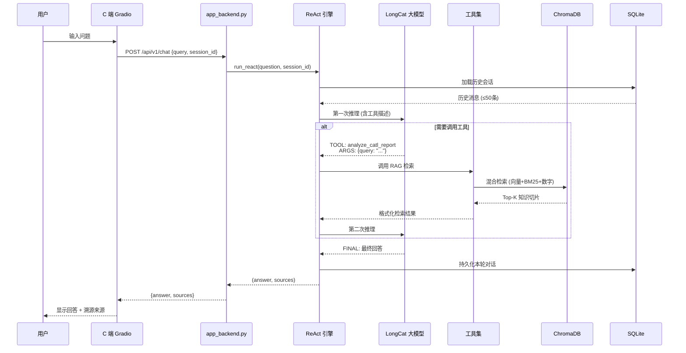
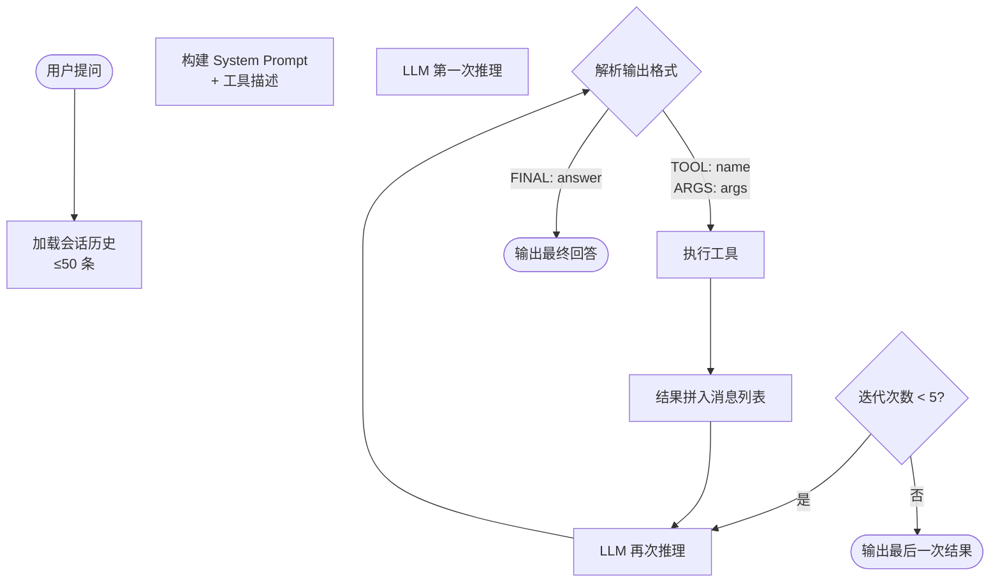
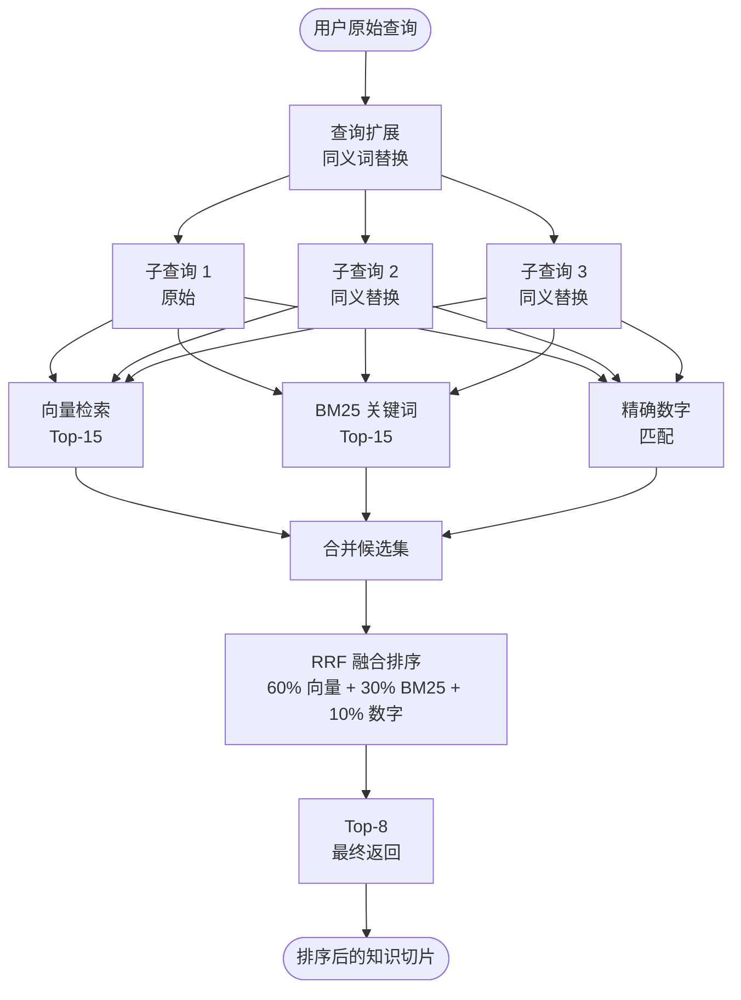
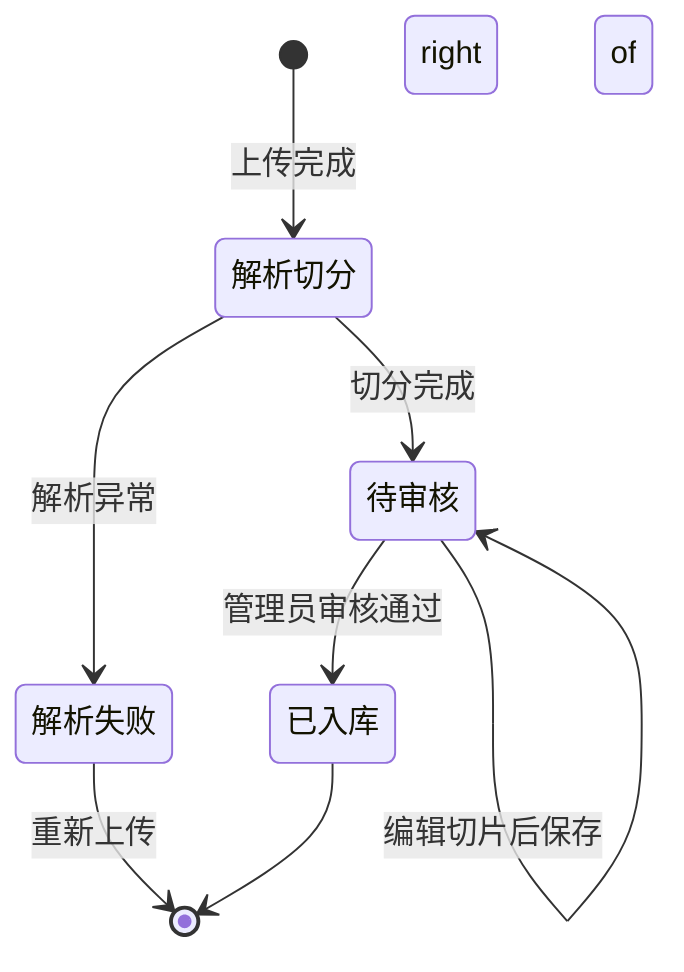
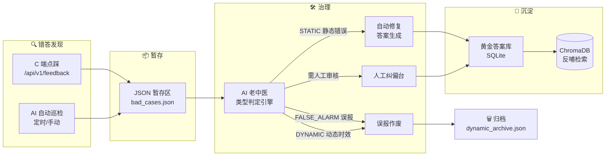
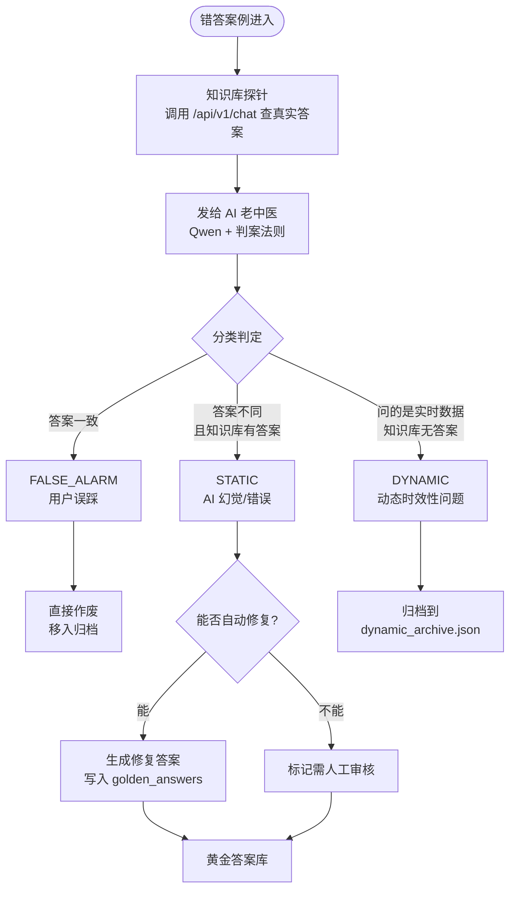
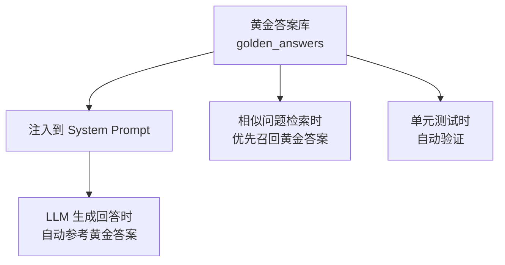
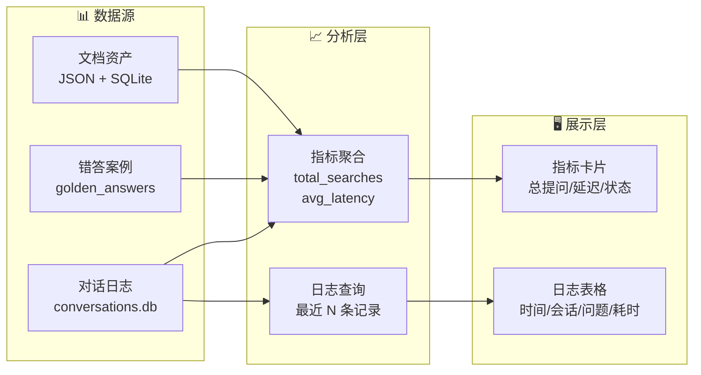
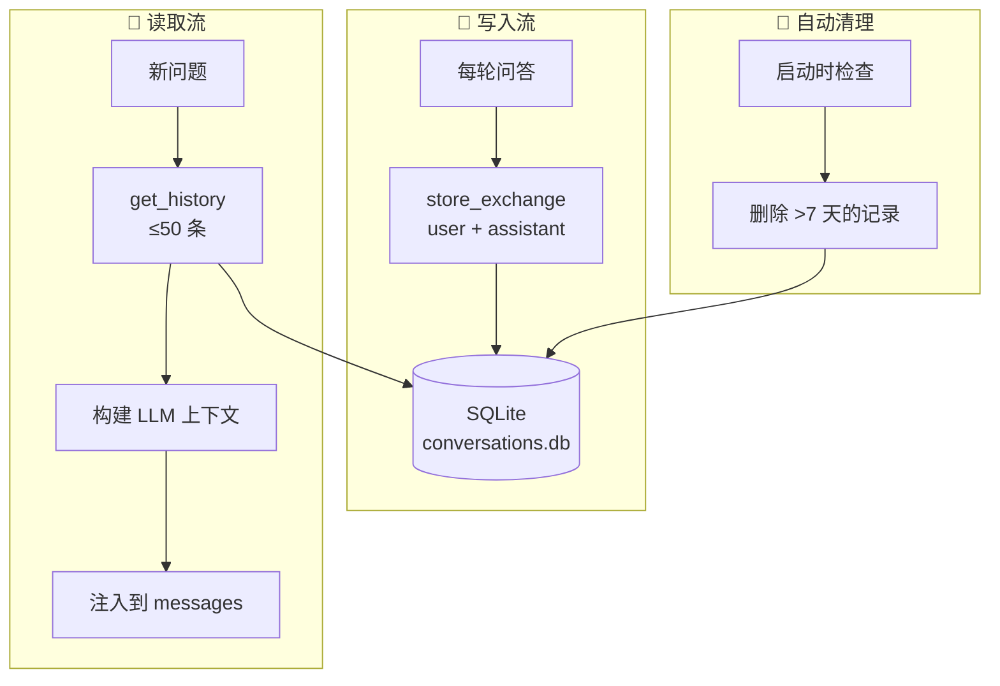
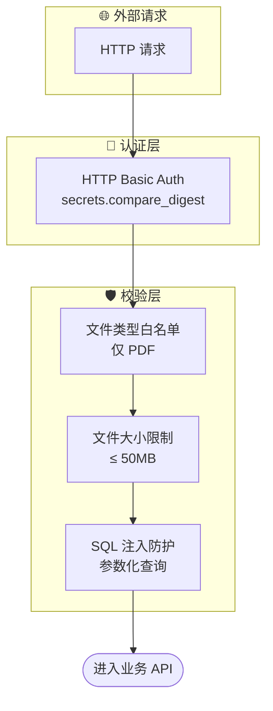

# Tiday 项目数据流程图与架构图集

> 本文档包含 Taday 企业级多智能体金融分析系统的全部核心数据流与架构图，可直接用于 PPT 展示或技术答辩。  
> 图中使用的 Mermaid 语法可在 VS Code、Typora、Obsidian 等工具中渲染，也可根据样式需求导入 PPT。

---

## 一、系统总体架构

### 1.1 分层架构图

```mermaid
graph TB
    subgraph 前端层["🖥️ 前台界面层"]
        C[C 端问答界面<br/>app_frontend_optimized.py<br/>Gradio]
        B[B 端管理后台<br/>admin_frontend_optimized.py<br/>Gradio]
    end

    subgraph API 层["⚡ API 服务层"]
        API_C[C 端 API<br/>app_backend.py<br/>FastAPI :7860]
        API_B[B 端 API<br/>admin_backend.py<br/>FastAPI :7861]
    end

    subgraph 引擎层["🧠 核心引擎层"]
        REACT[ReAct 引擎<br/>react_engine.py]
        RAG[混合检索引擎<br/>rag_tool.py]
        TOOLS[工具集]
    end

    subgraph 存储层["💾 存储层"]
        CHROMA<br/>ChromaDB<br/>向量库]
        SQLite[(SQLite<br/>对话日志<br/>运营数据)]
        FS[文件系统<br/>PDF 原文]
    end

    C --> API_C
    B --> API_B
    API_C --> REACT
    API_B --> REACT
    REACT --> RAG
    RAG --> TOOLS
    RAG --> CHROMA
    REACT --> SQLite
    REACT --> FS
    TOOLS --> CHROMA
    TOOLS --> SQLite
```

---

### 1.2 核心职责速查

| 层级 | 模块 | 职责 |
|------|------|------|
| 前端层 | C 端 Gradio | 用户问答、数据溯源、历史会话恢复 |
| 前端层 | B 端 Gradio | 文档上传/审核、问答质检、运营监控 |
| API 层 | app_backend.py | 对话接口、反馈收集、检索代理 |
| API 层 | admin_backend.py | 文档管理 API、巡检触发、分析数据 |
| 引擎层 | ReAct 引擎 | 意图识别、工具调度、结果整合 |
| 引擎层 | 混合检索引擎 | 向量+BM25+数字匹配的三路检索 |
| 存储层 | ChromaDB | 知识切片向量、元数据 |
| 存储层 | SQLite | 对话记录、Bad Case、黄金答案 |
| 存储层 | 文件系统 | 原始 PDF、临时上传文件 |

---

## 二、C 端用户问答数据流

### 2.1 完整问答流程



---

### 2.2 问答接口响应示例

```json
// 请求
{
  "query": "宁德时代 2025 年营收是多少？",
  "session_id": "abc-123"
}

// 响应
{
  "answer": "根据宁德时代 2025 年年度报告，公司全年营收为 3165.06 亿元...",
  "sources": [
    {
      "chunk_id": "chk_a1b2c3",
      "text_preview": "2025 年度，公司营业收入 3165.06 亿元...",
      "similarity_score": 0.92
    }
  ]
}
```

---

## 三、ReAct 引擎工作流

### 3.1 核心循环逻辑



---

### 3.2 工具调度矩阵

| 工具名称 | 触发条件 | 输入 | 输出 |
|----------|----------|------|------|
| `analyze_catl_report` | 财报知识、营收/利润/毛利率、行业政策 | query: 自然语言 | 格式化检索结果 |
| `get_stock_price` | 实时股价、市值、K 线 | ticker: 股票代码 | 股价/涨跌幅 |
| `web_search_tool` | 最新新闻、政策、事件 | query: 搜索关键词 | 摘要文本 |
| `query_financial_db` | 跨年对比、自定义 SQL 分析 | query: 结构化查询 | 数据表结果 |

---

## 四、混合检索引擎数据流

### 4.1 查询扩展 + 三路召回 + 融合排序



---

### 4.2 查询扩展示例

```
输入: "宁德时代 2025 年营收"

扩展结果 →
  1. "宁德时代 2025 年营收"     (原始)
  2. "宁德时代 2025 年营业收入" (同义: 营收→营业收入)
  3. "宁德时代 2025 年总收入"   (同义: 营收→总收入)
  4. "宁德时代 2025 年销售额"   (同义: 营收→销售额)
```

### 4.3 BM25 数字匹配示例

```
查询: "2025 年净利润 155.8 亿元"
数字提取: {"2025", "155.8"}

文档 A: "...2025 年净利润 155.8 亿元..."  → 命中 2 个 → +0.30
文档 B: "...2024 年净利润 140.2 亿元..."  → 命中 0 个 → +0.00
文档 C: "...2025 年营业收入 3165 亿元..." → 命中 1 个 → +0.15

最终排序: A > C > B
```

---

## 五、B 端知识库运营数据流

### 5.1 PDF 上传 → 切片 → 入库流程

```mermaid
sequenceDiagram
    participant U as 管理员
    participant FE as B 端 Gradio
    API as admin_backend.py
    PARSER as PyMuPDFReader
    SPLIT as SentenceSplitter
    DB as SQLite
    VDB as ChromaDB

    U->>FE: 上传 PDF 文件
    FE->>API: POST /admin/api/upload
    API->>API: 校验类型/大小 (PDF/50MB)
    API->>API: 生成 doc_id, 保存临时文件
    API-->>FE: 202 {status: "uploading"}
    API->>PARSER: 异步触发解析
    PARSER->>PARSER: 提取文本+表格
    PARSER->>SPLIT: 语义分块 500字/块
    SPLIT->>DB: 写入 chunks 表 (状态: active)
    API->>DB: 更新 documents 状态 → pending
    Note over API: 管理员可在 Tab1 看到新文档
    U->>FE: 点击文档行 → 进入审核台
    FE->>API: GET /admin/api/docs/{doc_id}/chunks
    API-->>FE: 切片列表
    U->>FE: 编辑切片文本 → 保存
    FE->>API: PUT /admin/api/chunks/{chunk_id}
    Note over API: 管理员确认无误
    U->>FE: 点击「发布入库」
    FE->>API: POST /admin/api/docs/{doc_id}/publish
    API->>VDB: 向量化 + 写入 ChromaDB
    API->>DB: 更新状态 → published
    API-->>FE: 发布成功
```

---

### 5.2 文档生命周期状态机



---

## 六、错答治理闭环

### 6.1 全链路治理流程



---

### 6.2 AI 老中医判定逻辑



---

### 6.3 黄金答案反哺机制



---

## 七、B 端质检工作台数据流

### 7.1 人工纠偏流程

```mermaid
sequenceDiagram
    participant U as 管理员
    FE as B 端 Tab2
    API as admin_backend.py
    DB as SQLite

    U->>FE: 进入「问答质检」Tab
    FE->>API: GET /admin/api/bad_cases
    API->>DB: 查询 bad_cases 表
    API-->>FE: 待审核案例列表

    U->>FE: 点击某条案例
    FE->>API: GET /admin/api/bad_cases/{case_id}
    API-->>FE: 案例详情 + 修复建议

    alt 管理员确认修正
        U->>FE: 填写标准答案
        FE->>API: POST /admin/api/bad_cases/{case_id}/fix
        API->>DB: 更新 status → fixed
        API-->>FE: 修复成功
    end

    alt 标记误报
        U->>FE: 点击「误报作废」
        FE->>API: POST /admin/api/bad_cases/{case_id}/ignore
        API->>DB: 更新 status → ignored
        API-->>FE: 已作废
    end

    Note over FE: 刷新列表
    FE->>API: GET /admin/api/bad_cases
    API-->>FE: 更新后的列表
```

---

## 八、AI 自动巡检时序

```mermaid
sequenceDiagram
    participant U as 管理员
    API as /admin/api/bad_cases/auto_heal
    QWEN as Qwen 老中医
    LC as LongCat 修复师
    DB as SQLite
    ARCHIVE as 归档文件

    U->>API: 点击「启动 AI 自动巡检」
    API->>DB: 读取 pending 案例

    loop 每批 3 条案例
        API->>API: 调用 /api/v1/chat 查真实答案
        API->>QWEN: 发送判案 Prompt
        QWEN-->>API: {type, reason}

        alt STATIC (可修复)
            API->>LC: 发送修复 Prompt
            LC-->>API: 标准答案
            API->>DB: 写入 golden_answers<br/>status → auto_fixed
        end

        alt FALSE_ALARM (误报)
            API->>ARCHIVE: 移入归档
        end

        alt DYNAMIC (动态时效)
            API->>ARCHIVE: 移入 dynamic_archive
        end

        alt 无法修复
            API->>DB: status → manual_review
        end
    end

    API-->>U: {healed_count, manual_count, ...}
```

---

## 九、数据分析流



---

## 十、会话持久化数据流



**会话表结构**

```sql
CREATE TABLE conversations (
    id          INTEGER PRIMARY KEY AUTOINCREMENT,
    session_id  TEXT    NOT NULL,
    role        TEXT    NOT NULL CHECK(role IN ('user','assistant','system')),
    content     TEXT    NOT NULL,
    timestamp   DATETIME DEFAULT CURRENT_TIMESTAMP
);
```

---

## 十一、数据溯源流

```mermaid
sequenceDiagram
    participant U as 用户
    FE as C 端界面
    API as app_backend.py

    U->>FE: 提问
    FE->>API: POST /api/v1/chat {query, session_id}
    API-->>FE: {answer, sources: [{chunk_id, text_preview, score}]}

    U->>FE: 点击某个来源标签
    FE->>FE: 展示完整原文片段 + 文档名 + 相关度分数
    Note over FE: 支持追溯到原 PDF 原文段落
```

---

## 十二、部署架构（Docker Compose）

```mermaid
flowchart TB
    subgraph 客户端["🌐 用户浏览器"]
        C_BTN[C 端 :7860]
        B_BTN[B 端 :7861]
    end

    subgraph Docker["🐳 Docker Compose"]
        Direction TB
        subgraph C端容器["app 容器"]
            APP_C[app_backend.py<br/>FastAPI]
            FE_C[app_frontend_optimized.py<br/>Gradio]
        end
        subgraph B端容器["admin 容器"]
            APP_B[admin_backend.py<br/>FastAPI]
            FE_B[admin_frontend_optimized.py<br/>Gradio]
        end
        subgraph 向量库["chroma 容器"]
            CHROMA[ChromaDB<br/>持久化卷]
        end
    end

    C_BTN --> FE_C
    B_BTN --> FE_B
    FE_C --> APP_C
    FE_B --> APP_B
    APP_C --> CHROMA
    APP_B --> CHROMA

    volumes[("持久化卷<br/>chroma_db<br/>conversations.db<br/>golden_answers")] -.-> CHROMA
    volumes -.-> APP_C
    volumes -.-> APP_B
```

---

## 十三、存储方案总览

| 存储引擎 | 存储内容 | 路径/表 | 备注 |
|----------|----------|---------|------|
| ChromaDB | 知识切片向量 | `chroma_db/` | 随项目重启持久化 |
| SQLite | 对话记录 | `conversations.db` | WAL 模式，7 天自动清理 |
| SQLite | 文档/切片 | `documents.db` | doc + chunk 元数据 |
| SQLite | 黄金答案 | `golden_answers` | 修复后的高质量 QA |
| JSON | Bad Case | `bad_cases.json` | 草稿箱暂存 |
| JSON | 动态归档 | `dynamic_archive.json` | 时效性内容归档 |
| 文件系统 | 原始 PDF | `data/uploads/` | 上传的原始文件 |
| 文件系统 | 临时文件 | `tmp/upload/` | 处理后自动删除 |

---

## 十四、安全架构



---

## 十五、性能优化策略

| 优化点 | 策略 | 效果 |
|--------|------|------|
| LLM 调用 | 全局单例 + 连接复用 | 避免重复初始化 |
| Embedding | 限流重试 + 指数退避 | 防止 API 限流 |
| BM25 | 语料库 DF 缓存 | 查询时无需遍历全部节点 |
| 临时引擎 | LRU 内存淘汰 (50个) | 防内存泄漏 |
| 会话存储 | SQLite WAL 模式 | 提升并发读写性能 |
| 向量检索 | Top-K 截断 + RRF 融合 | 减少无效计算 |
| 文件上传 | 异步后台任务 | 不阻塞主线程 |
| 对话历史 | 限制 ≤50 条 | 控制 Token 消耗 |

---

## 十六、项目目录结构

```
finance_agent_3/
├── app_backend.py              # C 端 FastAPI 主入口
├── admin_backend.py            # B 端 FastAPI 主入口
├── app_frontend_optimized.py   # C 端 Gradio 界面
├── admin_frontend_optimized.py # B 端 Gradio 界面
├── config.py                   # 全局配置
├── logger.py                   # 日志模块
│
├── core/
│   └── react_engine.py         # ReAct 引擎核心
│
├── tools/
│   ├── rag_tool.py             # 混合检索引擎
│   ├── price_tool.py           # 股价查询工具
│   ├── web_search_tool.py      # 联网搜索工具
│   ├── sql_tool.py             # SQL 查询工具
│   └── financial_chunker.py    # 金融文本分块器
│
├── routes/
│   ├── documents.py            # 文档管理路由
│   ├── feedback.py             # 反馈/Bad Case 路由
│   ├── auto_heal.py            # AI 自动巡检路由
│   └── analytics.py            # 数据分析路由
│
├── utils/
│   ├── conversation_store.py   # 对话持久化
│   └── json_store.py           # JSON 文件读写
│
├── data/
│   ├── uploads/                # 上传的 PDF
│   └── chroma_db/              # ChromaDB 持久化
│
├── tests/                      # 单元测试
├── Dockerfile                  # Docker 构建
├── docker-compose.yml          # 编排文件
└── requirements.txt            # 依赖清单
```

---

## PPT 使用建议

1. **第 3 页（项目概览）** → 使用「一、系统总体架构」的 1.1 分层架构图
2. **第 5 页（混合检索）** → 使用「四、混合检索引擎数据流」的 4.1 流程图
3. **第 6 页（ReAct）** → 使用「三、ReAct 引擎工作流」的 3.1 核心循环逻辑
4. **第 7 页（错答治理）** → 使用「六、错答治理闭环」的 6.1 全链路治理流程
5. **第 9 页（知识库运营）** → 使用「五、B 端知识库运营数据流」的 5.1 时序图
6. **第 12 页（总结展望）** → 使用「十五、性能优化策略」表格

所有 Mermaid 图表可在 VS Code 中安装 Markdown Preview Mermaid Support 插件实时预览，也可导出为 PNG/SVG 插入 PPT。
